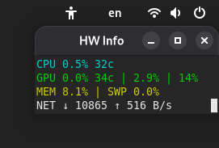

# CLI
A bunch of command-line scripts for debian-based linux distributions

> .windows scripts are frozen

### Debian scripts
| Script | Description |
| ------- | --- |
| about | Get general information about the system |
| adb-debloat | Debloat android device with package list |
| adb-pm-list | List all/enabled/disabled packages |
| adb-pm-set | Enable/disable a package by id |
| adb | A quick launch for adb, support all arguments |
| apt-download | Download .deb package without installation |
| apt-history | Show apt run history and what was done |
| apt-install-common | Install common packages, codecs and fonts |
| apt-install-dev | Install development packages |
| apt-install-headers | Install linux kernel headers |
| apt-install-steam | Add i386 arch and install steam-installer |
| apt-install-vm | Install gnome-boxes and libvirt daemon |
| apt-install-wine | Install wine and optionally wine32:i386 |
| apt-list | List installed packages |
| apt-show | Show package plus dependencies and paths |
| apt-src-gen | Generate debian sources.list file |
| apt-src-mirror | Find the fastest debian mirrors |
| apt-unlock | Unlock apt and fix corrupted install |
| aria2 | Aria2c downloader with built-in config file |
| backup-disk | Sync local disk to external hard disk |
| backup-home | Backup home directory to tar archive |
| block | Run a command without internet access |
| btc-check | Check bitcoin balance by address |
| btc-gen | Generate bitcoin keys and base64 |
| chrome | A quick launch for portable google-chrome |
| chromium-get | Get latest chromium dev-build link |
| cpu-limit | Limit cpu by percent, freq and no-turbo |
| debug-core | debug core crash dumps using gdb |
| debug-kernel | debug kernel messages |
| dns-bench | Benchmark DNS servers |
| dns-flush | Flush dns cache |
| electron | A quick launch for electron apps |
| git-amend | Amend last commit |
| git-clear | Optimize and shrink local .git |
| git-commit | Commit changes |
| git-discard | Discard changes |
| git-init | Initialize a repository |
| git-last | Commit and squash (redo last commit) |
| git-push | Force push to remote (main/master) |
| git-reset | Reset a repository |
| git-revert | Revert commits to commit-hash |
| git-squash | Squash multiple commits |
| git-ui | A quick launch for terminal ui |
| glances | A quick launch for glances (python) |
| gnome-debloat | A tiny debloater for GNOME |
| gnome-install | Install gnome-core and required packages |
| http-server | Simple file server with subdirectories |
| http-upload | Simple file upload/download server |
| img-convert | Convert image format using imagemagick |
| img-resize | Resize by size/percent using imagemagick |
| iso-make | Create basic .iso image from a directory |
| meta-rm.sh | Remove metadata using exiftool.exe (wine) |
| meta-vu.sh | View metadata using exiftool.exe (wine) |
| net-interface | Edit and update /etc/network/interfaces |
| net-reset | Restart networking service |
| npm-download | Download npm module to current directory |
| npm | A quick launch for npm (wine) |
| nvidia-install | Install nvidia driver on debian |
| nvidia-watch | Watch nvidia-smi information |
| proxy-catcher | Scrap fresh proxies across the web |
| purge-hard | Purge and rebuild the ~/.cache directory |
| purge | Delete unused packages and temporary files |
| python-make | Make python 3 from source |
| python-purge | Purge __pycache__ of all ~/.venv subs |
| screensaver | A windows-style blank screensaver |
| secureboot | Disable or re-enable secureboot |
| shc | Converts the shell script into binaries |
| speedtest | Get and run speedtest-cli |
| ssh-keygen | Generate ed25519 and rsa-4096 keys |
| ssl-keygen | Generate rsa-4096 cert and key |
| swap-make | Make swap file and mount for next boot |
| termux-setup | Setup termux with git and python |
| termux-tor | Install tor with snowflake plugin |
| unrar | Unrar archive with support for password (wine) |
| tcpdump | A quick tcpdump network traffic monitor |
| term-rec | Record borderless gnome-terminal window |
| venv-activate | Activate a venv by name |
| venv-create | Create a new venv in ~/.venv |
| venv-link | Symlink python packages to a venv |
| vlc | Start VLC with terminal user-interface |
| webm-to-gif | Convert .webm to gif and preserve palette |
| xcolor | A basic color picker, converter and eyedropper |
| xspf-checker | Check xspf playlist for broken links |

### GNOME extensions
| Extension | Description |
| ------- | --- |
| panel-hwinfo@nimadez | Add hardware info to panel |
| panel-transparent@nimadez | Add transparency to panel |



## FAQ
How to run these scripts system wide?
```
git clone https://github.com/nimadez/cli
sh install.sh
```
How to install Debian 12 with gnome-core desktop?
```
0- secureboot.sh          disable only if you do not intend to return to windows
1- Install minimal debian 12 to start from command-line
   (do not select 'allow login as root' during installation)
2- Install and clone git
   $ sudo apt install git && git clone https://github.com/nimadez/cli
3- apt-src-mirror.sh      find the fastest debian mirrors
   apt-src-gen.sh         generate debian sources
   $ update && full-upgrade && reboot
4- apt-install-headers.sh install kernel headers
   nvidia-install.sh      install nvidia driver (all non-free)
5- gnome-install.sh       minimal gnome-core only, no firefox and games (all free)
6- apt-install-*          common, dev, steam, vm, wine (all free)
   $ gnome-debloat.sh
7- swap-make.sh           make a swap file if you don't have a swap partition

apt-list.sh installed
apt-list.sh contrib
apt-list.sh non-free
apt-list.sh non-free-firmware
apt-list.sh i386
```

## History
```
↑ 2024 - migrating to debian linux after 30 years of ms-dos/win32
↑ Created in 2019 for system automation on windows machine

"A machine can reprogram another machine from scratch."
```

## License
Code released under the [GPL-3.0 license](https://github.com/nimadez/cli/blob/main/LICENSE).

              _,deb$$$$$gg.
           ,g$$$$$$$$$$$$$$$X.
         ,g$$X""       """Y$$.".
       ,$$X'              `$$$. 
      ',$$X       ,ggx.     `$$b:
      `d$$'     ,$X"'   .    $$$
       $$X      d$'     ,    $$X
       $$:      $$.   -    ,d$$'
       $$;      Y$b._   _,d$X'
       Y$$.    `.`"Y$$$$X"' 
       `$$b      "-.__
        `Y$$b
         `Y$$.
           `$$b.
             `Y$$b.
               `"Y$b._
                   `""""
