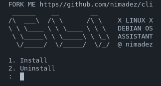
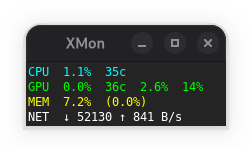

# CLI


### Debian Assistant CLI

> This repository contains various scripts ```~100 kb``` for working with the Debian OS and the Linux kernel, from installation to everyday scripts. This repository is not optimized for the end-user in any way, does not contain any binaries, and ***does not include scripts that could cause security issues***. Most scripts have been bug-fixed, tested, and updated, and are used on a daily basis.

### Minimal Debian Installation
Kernel: ```6.12.41```<br>
Release: ```Debian 13 Trixie```<br>
Desktop: ```GNOME 48 (gnome-shell, ~300 MB deb)```<br>
Display servers: ```X11 (default)``` ```Wayland (testing)```<br>
Total download: ```~700 MB deb without CUDA```<br>
Last installation: ```24-Aug-2025 (13.0.0-amd64-DVD)```<br>
Installation time: ```~30 minutes (2-4 Mb/s)```<br>
Known issues: ```none```
```
0- [Disable Secure Boot]

   $ sudo mokutil --disable-validation

   * https://wiki.debian.org/SecureBoot
```
```
1- [Install Debian]

   - Select Advanced options > "Expert Install"
   - Install minimal Debian to start from command-line
   - Do not select "allow login as root" to enable the "sudo" command
   - Do not download or install extras
   - Do not select any desktop in tasksel (just check "standard system utilities")
   - Most of the installation options are fine by default and you can press Enter

   Minimum recommended partitions (manual):
      ├─ #1 VFAT  /boot/efi   ==1.0 GB
      ├─ #2 EXT4  /           >=16.0 GB (>24.0 GB swap as file, depends on RAM)
      ├─ #3 EXT4  /home       ∞
      └─ #4 EXT4  /media      ∞
      * I don't use a swap partition because I want it to be variable.

   $ sudo apt edit-sources    # comment out the "cdrom" line if needed
```
```
2- [Setup Networking]

   [Automatic]
   net-tether.sh              # quick setup USB tethering interface (easiest)
   net-wifi.sh                # wifi manager using network-manager

   * If connected via USB tethering, if the network is disconnected
     after a reboot, you will need to run "net-tether.sh" again.

   [Manual]
   $ ip link
   $ sudo nano /etc/network/interfaces
   Add new lines:
      allow-hotplug {interface-name}
      iface {interface-name} inet dhcp
   $ sudo systemctl restart networking
```
```
3- [Clone Repository]

   $ sudo apt install git
   $ git clone https://github.com/nimadez/cli

   * If re-installing, a better method is to clone the repository
     to the /home partition before installing, then you will also
     have access to the automatic network configuration scripts.
```
```
4- [Select Branch]

   apt-sources.sh             # generate sources (debian only, no extra sources)
   
   $ sudo apt update
   $ sudo apt full-upgrade
   $ sudo reboot              # reboot if there are any kernel or major updates

   * Trixie "stable-proposed" branch without "backports" is recommended. (option 3)
```
```
5- [Software Installation]

   install/apt-headers.sh     # kernel headers
   install/apt-nvidia.sh      # nvidia driver, reboot is required (non-free - optional)
   install/apt-cuda.sh        # nvidia cuda toolkit (non-free - optional)
   install/apt-free.sh        # common free software (99.9% free)
   install/apt-vm.sh          # install qemu and libvirt (free - optional)
```
```
6- [Desktop Installation]

   install/apt-gnome.sh       # minimal gnome-shell with a minimal set of software (free)
```
```
7- [Verify Installation]

   about.sh                   # get basic information about the system
   about-apt.sh               # get the number, list and history of available packages
   about-net.sh               # get basic network info
   about-root.sh              # get list of / permissions
   about-users.sh             # get list of users
   about-kernel.sh            # get the kernel log and check for possible errors
   about-groups.sh            # get list of groups
   about-services.sh          # get list of all active services
```
```
8- [Finish Installation]

   swap-make.sh               # make a swap file if you don't have a swap partition
   swap-grub.sh               # run only if you are not installing any desktop (hibernate debian)
   keygen.sh                  # generate SSH and SSL keys (optional)

   patch/gnome-user-theme.sh  # a simple gnome extension to load user theme
   patch/wayland-nvidia.sh    # fix wayland nvidia issues (if you want to enable wayland)

   $ cp /etc/skel/.bashrc ~   # if the home partition is formatted, copy the .bashrc file
   $ sudo reboot
```
> - All steps and scripts are updated with each installation to include any missing changes.
> - Remember to reinstall kernel headers after every kernel update. ("testing" branch only)
> - Download size for GNOME includes shared packages and can be much smaller. (up to 50%)
> - The CUDA toolkit is about 2 GB in size and can be ignored and installed later.
> - You can skip step 6 and use pure Debian via the command-line.

### Installing Scripts
```
$ sh cli-install.sh
$ cli
```


##### Running XMon hardware monitor
```
sudo apt install xterm wmctrl
echo "hw-xmon-start" >> ~/.config/autostart/startup.sh
```


## FAQ
#### How to create a startup script?
```
$ nano ~/.config/autostart/startup.sh
$ nano ~/.config/autostart/startup.desktop

[Desktop Entry]
Type=Application
Name=Startup
Exec=x-terminal-emulator -e "sh /home/<USER>/.config/autostart/startup.sh"
Hidden=false
NoDisplay=false
X-GNOME-Autostart-enabled=true
X-GNOME-Autostart-Delay=10
```

#### How to create a custom service?
```
$ sudo nano /usr/local/bin/custom_service.sh
$ sudo chmod +x /usr/local/bin/custom_service.sh
$ sudo nano /etc/systemd/system/custom.service

[Unit]
Description=Custom Service
After=network.target

[Service]
ExecStart=/usr/local/bin/custom_service.sh
Restart=always
User=nobody
Group=nogroup

[Install]
WantedBy=multi-user.target

$ sudo systemctl daemon-reload
$ sudo systemctl enable custom.service
$ sudo systemctl restart custom.service
```

#### How to enter the command-line before display-manager?
```
1. Reboot
2. During the GRUB boot menu, press the 'e' key
3. Add the number '3' to the end of the line that starts with 'linux /boot'
   linux /boot/vmlinuz-... root=... quite 3
4. Press Ctrl + x
```

## History
```
↑ Revision: Less scripts, more efficiency
↑ Upgrade to Debian 13 Trixie
↑ All Linux, currently all my devices are Linux based
↑ Celebrating 1 year with Linux on the everyday desktop PC 🎂
↑ Wine requirement reduced to zero, migration completed
↑ Debian Assistant CLI
↑ Q1 2024 - Migrating to Debian Linux after 30 years of MS-DOS/Win32
↑ Created in 2019 for system automation on Windows machine

"A machine can reprogram another machine from scratch."
```

> 🎭 *"I had something like undo syndrome in the first year, which was both annoying and pleasant in the mornings. Today, that condition seems to be gone, but a little of that pleasant mood still remains."*

## License
Code released under the [GPL-3.0 license](https://github.com/nimadez/cli/blob/main/LICENSE).

## Credits
- [Linus Torvalds](https://github.com/torvalds)
- [Linux Kernel](https://github.com/torvalds/linux)
- [Debian](https://www.debian.org/)
- [GNOME](https://www.gnome.org/)
