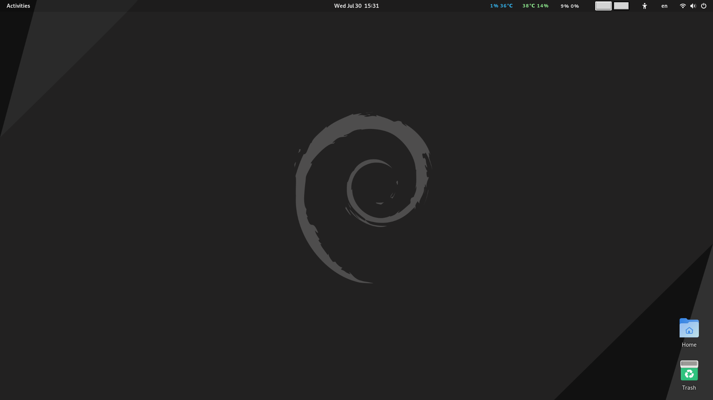

# CLI


**Debian Assistant CLI**<br>
Kernel: 6.1.0 to 6.9.12<br>
Branch: Bookworm, Trixie

This repository contains a variety of scripts for working with the Debian OS and the Linux kernel, from installation to everyday scripts.

###### This repository is not optimized for the end-user in any way, and does not contain any binary files.

### GNOME Extensions

| Extension | GNOME |
| ------- | --- |
| panel-hwinfo-43@nimadez | 43 |
| panel-hwinfo-46@nimadez | 46 |  |

> - Add hardware info and transparency to panel (CPU usage + temp, GPU temp + fan, memory + swap)
> - If you need desktop icons, I recommend "Desktop Icons NG (DING)".



## FAQ
#### How to install Debian with GNOME-core desktop?
```
Last update: Jun-2025 (debian-12.11.0)

0- [Disable Secure Boot]
   $ sudo mokutil --disable-validation
1- [Install Debian]
   - Select "Expert Install"
   - Install minimal Debian 12 to start from command-line (no desktops)
   - Do not select "allow login as root" to enable the "sudo" command
   - Do not download or install extras, we're going to update the kernel
   $ sudo apt edit-sources    # comment out the "cdrom" line if needed
2- [Setup Networking]
   $ ip link
   $ sudo nano /etc/network/interfaces
   $ sudo service networking restart
   net-tether.sh              # quick setup USB tethering (optional)
3- [Git Clone]
   $ sudo apt install git
   $ git clone https://github.com/nimadez/cli
4- [Select Branch]
   apt-sources.sh             # generate sources (all debian, no extra sources)
   $ update && full-upgrade && reboot
5- [Software Installation]
   apt-install-headers.sh     # install kernel headers
   apt-install-nvidia.sh      # install nvidia driver, reboot is required (all non-free)
   apt-install-gnome.sh       # minimal gnome-core only, no firefox and games (all free)
   apt-install-free.sh        # install common free software
   gnome-debloat.sh           # be careful, it will remove the gnome-software
6- [Finish Installation]
   swap-make.sh               # make a swap file if you don't have a swap partition
   purge-cache.sh             # purge ~/.cache if you don't keep permanent files there
```
> * Bookworm "stable-proposed" branch without "backports" is recommended. (option 3 in step 4)
> * Remember to reinstall kernel headers after every kernel update. (testing branch)
> * Firefox has been removed from the gnome-core, but is highly recommended.

#### How to run these scripts system wide?
```
$ sh install.sh
```
> This will symlink scripts to /usr/local/bin and remove extensions.<br>
> All .sh, .py, and .js files in the /usr/local/bin directory will be affected.

## History
```
↑ All Linux, currently all my devices are Linux based
↑ Celebrating 1 year with Linux on the everyday desktop PC 🎂
↑ Wine requirement reduced to zero, migration completed
↑ Debian Assistant CLI
↑ Q1 2024 - Migrating to Debian Linux after 30 years of MS-DOS/Win32
↑ Created in 2019 for system automation on Windows machine

"A machine can reprogram another machine from scratch."
```

## License
Code released under the [GPL-3.0 license](https://github.com/nimadez/cli/blob/main/LICENSE).

## Credits
- [Linus Torvalds](https://github.com/torvalds)
- [Debian](https://www.debian.org/)
- [GNOME](https://www.gnome.org/)
