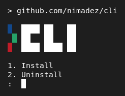

# Debian Assistant CLI


> This repository contains various scripts ```~100 kb``` for working with the Debian OS and the Linux kernel, from installation to everyday scripts. This repository is not optimized for the end-user in any way, does not contain any binaries, and ***does not include scripts that could cause security issues***.

> - All scripts should work well with ```bash``` or ```sh```.
> - All scripts that have long output are scrollable. (q = quit)
> - Be sure to read the comments inside the scripts before running.

- [Minimal Debian Installation](https://github.com/nimadez/cli#minimal-debian-installation)
- [CLI Installation](https://github.com/nimadez/cli#cli-installation)
- [CLI Programs](https://github.com/nimadez/cli#cli-programs)
- [FAQ](https://github.com/nimadez/cli#faq)
- [History](https://github.com/nimadez/cli#history)

## Minimal Debian Installation
Kernel: ```6.12.43```<br>
Release: ```Debian 13.1 Trixie```<br>
Desktop: ```GNOME 48 (gnome-shell)```<br>
Display servers: ```X11 (default)``` ```Wayland (testing)```<br>
Total download: ```~750 MB deb without CUDA```<br>
Last installation: ```7-Sep-2025 (13.1.0-amd64-DVD)```<br>
Installation time: ```~30 minutes (1-5 Mb/s)```<br>
Known issues: ```none```
```
0- [Disable Secure Boot]

$ sudo mokutil --disable-validation

* https://wiki.debian.org/SecureBoot
```
```
1- [Install Debian]

- Select Advanced options > "Expert install"
- Install minimal Debian to start from command-line
- Do not select "allow login as root" to enable the "sudo" command
- Do not download or install extras (you can also not set up the network)
- Do not select any desktop in tasksel (just check "standard system utilities")
- Most of the installation options are fine by default and you can press Enter

Minimum recommended partitions (manual):
    ├─ #1 VFAT  /boot/efi   ==1.0 GB
    ├─ #2 EXT4  /           >=16.0 GB (>24.0 GB swap as file, depends on RAM)
    ├─ #3 EXT4  /home       ∞
    └─ #4 EXT4  /media      ∞
    * I don't use a swap partition because I want it to be variable.

$ sudo apt edit-sources    # comment out the "cdrom" line if needed
```
```
2- [Setup Networking]

(Automatic)
net-tether.sh              # quick setup USB tethering interface (easiest)
net-wifi.sh                # wifi manager using network-manager

* If connected via USB tethering, if the network is disconnected
  after a reboot, you will need to run "net-tether.sh" again.

(Manual)
$ ip link
$ sudo nano /etc/network/interfaces
Add new lines:
    allow-hotplug {interface-name}
    iface {interface-name} inet dhcp
$ sudo systemctl restart networking
```
```
3- [Clone Repository]

$ sudo apt install git
$ git clone https://github.com/nimadez/cli
$ cd cli
$ sh cli-install.sh (optional)

* If re-installing, a better method is to clone the repository
  to the /home partition before installing, then you will also
  have access to the automatic network configuration scripts.
```
```
4- [Select Branch]

(Automatic)
apt-sources.sh              # generate standard debian sources.list

* Trixie "stable-proposed" branch without "backports" is recommended. (option 3)

(Manual)
$ sudo apt edit-sources

$ sudo apt update
$ sudo apt full-upgrade
$ sudo reboot               # reboot only if there are major updates such as kernel updates
```
```
5- [Driver and Software]

install/apt-sys-headers.sh  # linux kernel headers (required)
install/apt-drv-nvidia.sh   # nvidia driver, reboot is required (non-free - optional)
install/apt-drv-cuda.sh     # nvidia cuda toolkit (non-free - optional)
install/apt-com.sh          # common free software (free - recommended)
install/apt-com-vm.sh       # qemu virtual-machine emulator (free - optional)
install/apt-com-av.sh       # clamav, an open-source antivirus engine (free - optional)

* Remember to reinstall kernel headers after every kernel update.
* apt-com.sh contains software that is essential and recommended to be installed.
* CUDA toolkit is about 2 GB in size and can be ignored and installed later.
```
```
6- [Desktop Environment]

install/apt-env-gnome.sh    # minimal gnome-shell with a minimal set of software (free)

(Dev options)
install/apt-dev-labwc.sh    # minimal labwc wayland compositor for experimental purposes
install/apt-dev-sway.sh     # minimal sway wayland compositor for experimental purposes

* You can skip this step to use pure Debian via the command-line.
* I don't recommend installing multiple desktop environments together,
  but you can install multiple window managers (without display manager)
  along with the desktop, and you can also use software from other desktops.
```
```
7- [Verify Installation]

about.sh                    # get basic information about the system
about-apt.sh                # get the number, list, history, and details of packages
about-net.sh                # get basic network info
about-admin.sh              # get group/user entries from administrative database
about-kernel.sh             # get the kernel log and check for possible errors
about-services.sh           # get list of all active services
```
```
8- [Finish Installation]

swap-make.sh                # make a swap file if you don't have a swap partition
swap-grub.sh                # to hibernate debian command-line (optional - not usable by desktops)
keygen.sh                   # generate new GPG, SSH and SSL keys (optional)

patch/gnome-user-theme.sh   # a simple gnome extension to load user theme (optional)
patch/wayland-nvidia.sh     # fix wayland nvidia issues (if you want to enable wayland)

$ sudo reboot
```

## CLI Installation


```
git clone https://github.com/nimadez/cli
cd cli
sh cli-install.sh

cli
cli <script|script.ext> [args...]
cli <directory/script> [args...]
```
> - Only the ```cli.sh``` script is symlinked to the ```/usr/local/bin```, and this script is used to call the rest of the scripts.
> - You can even add and call your own custom scripts to the ```/cli``` directory, or easily remove the ones you don't want.
> - If you change the ```/cli``` directory or add new scripts, you just need to reinstall.
> - Languages: ```bash/sh``` ```python/py``` ```node/js``` ```perl/pl``` ```ruby/rb```
> - You cannot have two scripts with the same name but with different extensions, unless you call with an extension.
> - **Shebang is required for all scripts.**

## CLI Programs
> ⚠️ ***These programs are experimental and are made for personal use that you can try out. They are mainly built to fulfill a need and are not polished for the end-user.***

#### 🔷 XMon - hardware monitor *(x11/wayland)*

```
sudo apt install xterm wmctrl
gcc -o hw-xmon hw-xmon.c
cli hw-xmon-start

# Autostart
echo "cli hw-xmon-start" >> ~/.config/autostart/startup.sh

# XMon has been working in the corner of the screen for more than a few months and is fairly stable!
```

#### 🔷 WALKER 300 - TUI file browser *(x11/wayland)*

```
cli walk

# WALKER 300 is part of my daily work toolkit and is probably more than 95% stable!
```

#### 🔷 Codex - AI assistant and coder *(Fast CPU)*
```
curl -o b6316.tar.gz https://codeload.github.com/ggml-org/llama.cpp/tar.gz/refs/tags/b6316
cd b6316
cli make-llamacpp cpu llama.cpp-b6316
cli make-llamacpp gpu llama.cpp-b6316 (optional, see install/apt-drv-cuda.sh)

cli codex prompt      # gpu can be enabled
cli codexx prompt     # easy access to gpu mode

# This AI assistant has been a great help from time to time when I don't have access to the internet!
```
[Model: Qwen3-8B-GGUF](https://huggingface.co/unsloth/Qwen3-8B-GGUF)

#### 🔷 Additional Configs
```
cp /etc/skel/.bashrc ~
sed -i 's/#force_color_prompt=yes/force_color_prompt=yes/g' ~/.bashrc

cp ./.rc/.nanorc ~                      # custom nano configurations
sudo ln -s ~/.nanorc /root/.nanorc      # allow configs in sudo mode

cp ./.rc/gimp/* ~/.config/GIMP/3.0      # make GIMP look like photoshop (for GNOME)
```


## FAQ
#### How to create a startup script?
```
$ nano ~/.config/autostart/startup.sh
$ nano ~/.config/autostart/startup.desktop

[Desktop Entry]
Type=Application
Name=Startup
Exec=x-terminal-emulator -e "sh /home/<USER>/.config/autostart/startup.sh"
Hidden=false
NoDisplay=false
X-GNOME-Autostart-enabled=true
X-GNOME-Autostart-Delay=10
```

#### How to create a custom service?
```
$ sudo nano /usr/local/bin/custom_service.sh
$ sudo chmod +x /usr/local/bin/custom_service.sh
$ sudo nano /etc/systemd/system/custom.service

[Unit]
Description=Custom Service
After=network.target

[Service]
ExecStart=/usr/local/bin/custom_service.sh
Restart=always
User=nobody
Group=nogroup

[Install]
WantedBy=multi-user.target

$ sudo systemctl daemon-reload
$ sudo systemctl enable custom.service
$ sudo systemctl restart custom.service
```

#### How to enter the debian command-line before display manager?
```
1. Reboot
2. During the GRUB boot menu, press the 'e' key
3. Add the number '3' to the end of the line that starts with 'linux /boot'
   linux /boot/vmlinuz-... root=... quite 3
4. Press Ctrl + x

* In case of kernel conflicts, be sure to add the number '3' to the latest version.
```

## History
```
↑ Efficiency: only one script is installed and calls other scripts
↑ Upgrade to Debian 13 Trixie
↑ All Linux, currently all my devices are Linux based
↑ Celebrating 1 year with Linux on the everyday desktop PC 🎂
↑ Wine requirement reduced to zero, migration completed
↑ Debian Assistant CLI
↑ Q1 2024 - Migrating to Debian Linux after 30 years of MS-DOS/Win32
↑ Created in 2019 for system automation on Windows machine

"A machine can reprogram another machine from scratch."
```

> 🎭 *"I had something like undo syndrome in the first year, which was both annoying and pleasant in the mornings. Today, that condition seems to be gone, but a little of that pleasant mood still remains."*

## License
Code released under the [GPL-3.0 license](https://github.com/nimadez/cli/blob/main/LICENSE).

## Credits
- [Linus Torvalds](https://github.com/torvalds)
- [Linux Kernel](https://github.com/torvalds/linux)
- [Debian](https://www.debian.org/)
- [GNOME](https://www.gnome.org/)
- [llama.cpp](https://github.com/ggml-org/llama.cpp)
